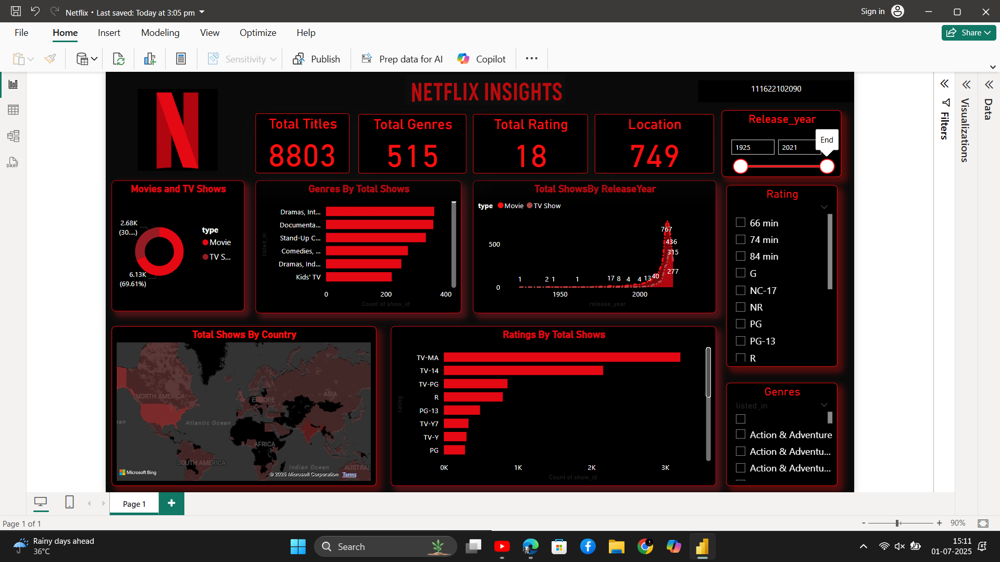

# 🎬 Netflix Content Insights Dashboard – Power BI

A dynamic Power BI dashboard designed to explore and analyze Netflix's content library with interactive visuals, custom slicers, and performance KPIs. Styled with a dark theme inspired by Netflix branding for a cinematic data storytelling experience.

---

## 📊 Key Features

- 🧮 **KPIs** – Total Titles, Average Ratings, and Runtime Trends
- 🎛️ **Slicers** – Interactive filters by Genre, Country, Release Year, and Rating
- 🗓️ **Time Trend Charts** – New releases over time
- 🌍 **Map Visual** – Geographic distribution of content
- 🧩 **Genre & Rating Breakdown** – Analyze maturity distribution and audience categories
- 🎨 **Custom Styling** – Netflix-inspired theme using bold red, dark grey, and white

---

## 📁 Repository Contents

| File                         | Description                           |
|------------------------------|---------------------------------------|
| `Netflix.pbix`     | Power BI dashboard file               |
| `dashboard1.png`      | Full dashboard screenshot preview     |
| `README.md`                  | This project documentation            |

---

## 📂 Dataset Information

Data sourced from public Netflix title dataset (originally from [Kaggle Netflix Dataset](https://www.kaggle.com/shivamb/netflix-shows)) including:
- Title, Type (Movie/TV Show)
- Genre, Country, Rating
- Release Year, Duration, Cast, and more

> *This project is for educational and portfolio demonstration purposes only.*

---

## 🛠️ Tools Used

- Microsoft Power BI (Desktop)
- Power Query (for data transformation)
- Custom Visual Formatting

---

## 📸 Preview

---

## 💡 Use Cases

This dashboard is a strong example of:
- Data-driven storytelling
- Interactive UX with slicers and layout panels
- Branding-focused report design
- Real-world BI skills demonstration

---

